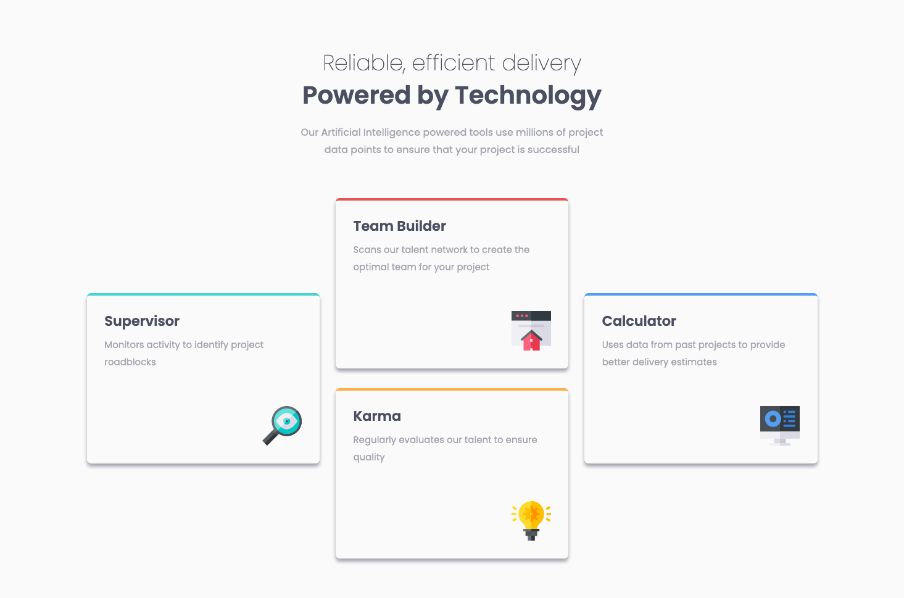
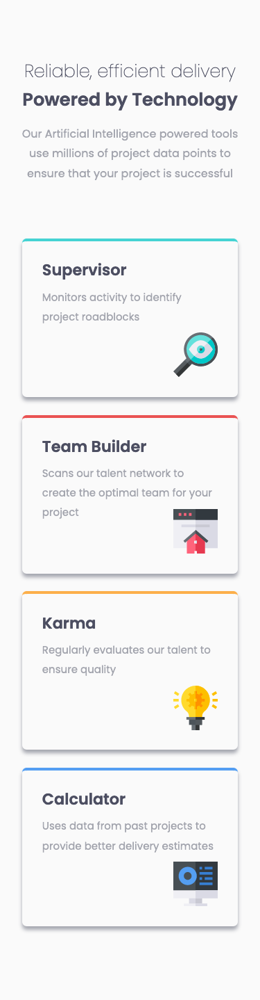

# Frontend Mentor - Four card feature section solution

This is a solution to the [Four card feature section challenge on Frontend Mentor](https://www.frontendmentor.io/challenges/four-card-feature-section-weK1eFYK). Frontend Mentor challenges help you improve your coding skills by building realistic projects.

## Table of contents

- [Overview](#overview)
  - [The challenge](#the-challenge)
  - [Screenshot](#screenshot)
  - [Links](#links)
- [My process](#my-process)
  - [Built with](#built-with)
  - [Continued development](#continued-development)
- [Author](#author)

## Overview

### The challenge

Users should be able to:

- View the optimal layout for the site depending on their device's screen size

### Screenshot

### Links

- Solution URL: [Link](https://www.frontendmentor.io/solutions/four-card-feature-wNe7wLfqPz)
- Live Site URL: [Link](https://four-card-feature-zeta-eosin.vercel.app/)

## My process

### Built with

- Semantic HTML5 markup
- CSS custom properties
- Flexbox
- Mobile-first workflow

### Continued development

I spent a while trying to figure this project using a grid instead of flexbox. Ultimately, I still ended up using a flexbox but I did learn a lot about grids and look forward to being able to utilize the new knowledge.

## Author

- Frontend Mentor - [@teuthix](https://www.frontendmentor.io/profile/teuthix)
